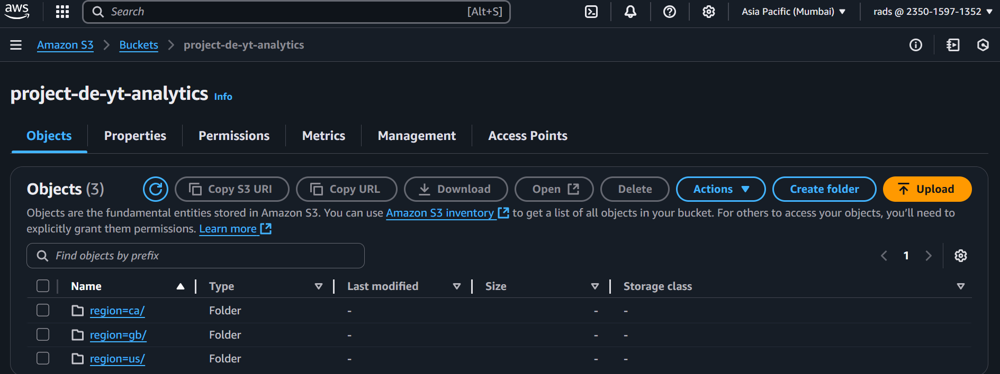

# ☁️ End-to-End YouTube Data Analytics Pipeline on AWS 🚀

## Project Overview ✨

This project is a practical demonstration of building a **robust, automated, and scalable data pipeline on Amazon Web Services (AWS)**. It takes raw YouTube trending data and category reference files, transforms them through various stages, and presents actionable insights via a dynamic dashboard.

---

### **Data Source**
The raw YouTube trending data and category reference files used in this project are sourced from the following Kaggle dataset:
* **Trending YouTube Video Statistics:** [https://www.kaggle.com/datasets/datasnaek/youtube-new] 
  
---

## Project Flow 🗺️

It wasn't just about building a pipeline; it was about:

- **Automating Complex Workflows:** Moving from manual processing to seamless, event-driven data flows.
- **Building a Multi-Layered Data Lake:** Structuring data for both raw preservation and optimized analytics.
- **Tackling Real-World Data Challenges:** From parsing tricky file formats to debugging automated triggers, every step was a learning experience.
- **Delivering Actionable Insights:** Transforming raw numbers into clear, understandable visualizations that tell a story.

---

## Core Architecture 📊

This diagram illustrates the comprehensive data flow and the AWS services leveraged throughout the project:

**Key Layers & Services:**

1.  **AWS S3 (Raw Layer):** Initial landing zone for diverse raw data (JSON category references and regional CSV statistics).
2.  **AWS S3 Event Notifications:** Triggers that activate serverless functions upon new data arrival.
3.  **AWS Lambda:** Event-driven compute for initial data transformations and orchestrating Glue jobs.
4.  **AWS Glue Crawlers:** Automatically discover and infer schema for data in S3, creating tables in the Glue Data Catalog.
5.  **AWS Glue Data Catalog:** The central metadata repository for all data lake tables.
6.  **AWS Glue ETL Jobs (Script & Visual):** Powerful, Apache Spark-based services for complex data transformations, joins, and aggregations.
7.  **AWS S3 (Cleansed Layer):** Stores transformed, quality-checked, and optimized (Parquet) data.
8.  **AWS S3 (Analytics/Reporting Layer):** The final, highly optimized and partitioned layer, ready for direct BI tool consumption.
9.  **AWS Athena:** Serverless query service enabling SQL analysis directly on S3 data via the Glue Data Catalog.
10. **Amazon QuickSight:** Our Business Intelligence tool for creating interactive dashboards and visualizing insights.
11. **AWS IAM:** Manages permissions and access control across all services.
12. **AWS CloudWatch:** For monitoring and logging pipeline execution.

---

## Technologies Used ⚙️

- **Cloud Platform:** Amazon Web Services (AWS)
  - **Storage:** S3
  - **Serverless Compute:** Lambda
  - **ETL & Cataloging:** Glue (Crawlers, ETL Jobs)
  - **Querying:** Athena
  - **Business Intelligence:** QuickSight
  - **Identity & Access Management:** IAM
  - **Monitoring & Logging:** CloudWatch
- **Programming Language:** Python
- **Key Python Libraries:** `boto3`, `awswrangler`, `pandas`
- **Data Formats:** JSON, CSV (Raw), Parquet (Cleansed, Analytical)
- **Tools:** AWS CLI, VS Code

---

## Project Journey: Building the Pipeline 🚶‍♀️

This project was built iteratively, processing different data types and building layers of refinement.

### Phase 1: Ingesting & Initial Processing of Raw Data

The journey began by preparing our raw YouTube datasets from Kaggle, consisting of two main types:

- **`raw_statistics_reference_data`:** JSON files containing category ID mappings.
- **`raw_statistics`:** Regional CSV files with video trending statistics.

All raw data was initially uploaded to our `project-de-yt` S3 bucket.

_Our raw S3 bucket, holding diverse data types for the pipeline:_

_JSON reference files now residing in the raw S3 bucket:_

### Phase 2: Transforming JSON Reference Data to Parquet

To optimize querying and storage, the raw JSON reference data was converted to Parquet.

1.  **Glue Crawler for Raw JSON:** An AWS Glue Crawler scanned the raw JSON data, inferring its schema and cataloging it in `db_youtube_raw`.
2.  **Lambda ETL:** An AWS Lambda function (`project-de-yt-lambda-json-parquet`) was developed using `awswrangler`. This function is triggered by S3 events, reads the raw JSON, normalizes its `items` array, and writes the output as Parquet files to `project-de-yt-cleansed-data/youtube/cleaned_reference_data/`.

_Glue Crawler output for the raw JSON data (table in Glue Data Catalog):_

_Lambda's environment variables, dynamically pointing to S3 buckets:_

_IAM role permissions ensuring Lambda can execute and interact with S3:_

_The result: Cleaned reference data, now in optimized Parquet format in S3:_

_Querying our newly cleansed JSON-derived data using AWS Athena:_

### Phase 3: Processing Raw Statistics (CSV) & Automated Ingestion

Next, the regional CSV files (raw statistics) underwent a similar cleansing process.

1.  **Glue Crawler for Raw CSV:** An AWS Glue Crawler scanned the `raw_statistics` CSV files, cataloging them in `db_youtube_raw`.
2.  **Initial Joins & Challenges:** We attempted to join this raw CSV data with our `cleaned_reference_data`. An initial hurdle was encountered with data type compatibility (e.g., string to bigint), which was resolved by adjusting schema understanding in the Glue Data Catalog rather than forcing complex type casting in code, maintaining data integrity.
3.  **Glue Job for CSV Cleansing:** A Glue job (using an Apache Spark script) was implemented to process the raw CSVs, filter out data with UTF-8 encoding issues (ensuring data quality), and write the clean, regional statistics data as Parquet files to `project-de-yt-cleansed-data/youtube/raw_statistics/`.

_Glue Crawler output for the raw CSV data:_

_An example Athena query joining raw CSV statistics with our cleaned reference data:_

_Our cleansed CSV-derived data, now in Parquet format in S3:_

#### Automating the CSV Pipeline Trigger ⚙️

A significant part of this phase involved setting up an automated S3 trigger. Upon new CSV file uploads to the raw bucket, an S3 event notification was configured to invoke a Lambda function, which in turn orchestrated the Glue job to process these files.

_The S3 Event Notification configuration for automating CSV data ingestion:_

_Proof of automation: Lambda invocations spiking after new CSV uploads, confirming the trigger works!_

### Phase 4: Building the Reporting Layer with Visual ETL

To enable more sophisticated and performant queries for BI, a dedicated reporting layer was created.

1.  **Visual ETL Glue Job:** A Glue visual ETL job was used to join the two already cleansed datasets (`cleaned_reference_data` and `raw_statistics` – both now in Parquet format in `project-de-yt-cleansed-data`). This join created a consolidated, analytical dataset.
2.  **Analytics S3 Bucket:** The output of this Glue job was stored in a new, dedicated `project-de-yt-analytics` S3 bucket, specifically designed for reporting. This data was also strategically partitioned (e.g., by region, category ID) to optimize query performance.

_The Glue Visual ETL canvas, orchestrating the joining of our two cleansed datasets:_

_Our final analytics layer in S3, showing efficient partitioning for querying:_

_Querying the highly optimized analytics layer using Athena – much cleaner queries!_

### Phase 5: Business Intelligence & Visualization with Amazon QuickSight

The culmination of the entire pipeline! Amazon QuickSight was connected directly to the tables in our Glue Data Catalog (which point to the `project-de-yt-analytics` bucket). This allowed for the creation of an interactive and visually rich dashboard, transforming complex data into clear, actionable insights about YouTube trends, likes, comments, and regional breakdowns.

_Key insights brought to life through the QuickSight Dashboard:_

---

## Code Repository 👩‍💻

The Python code for the AWS Lambda function, along with its dependencies, can be found in the `src/` directory.

- `src/lambda_function.py`: The core Python script for the JSON to Parquet transformation.
- `src/requirements.txt`: Lists all necessary Python library dependencies.

---

**This project truly reflects my passion for building robust data solutions, my commitment to problem-solving, and my dedication to continuous learning in the exciting field of data engineering. I'm excited about what's next!**
